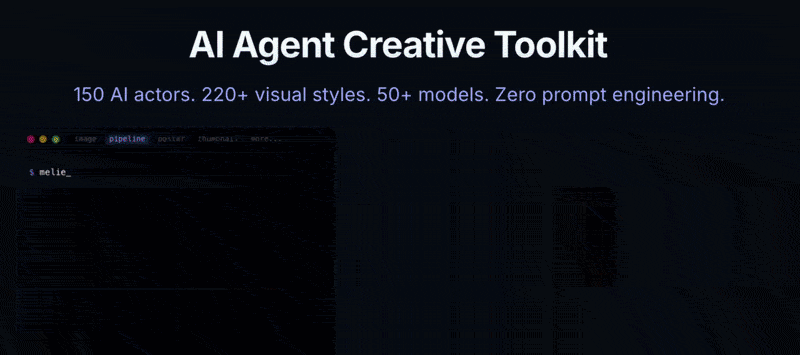

<p align="center">
  
</p>

<h1 align="center">Melies CLI — AI Agent Creative Toolkit</h1>

<p align="center">
  <strong>150 AI actors. 220+ visual styles. 50+ models. Zero prompt engineering.</strong><br>
  Generate images, videos, movie posters, and YouTube thumbnails from the command line.
</p>

<p align="center">
  <a href="https://www.npmjs.com/package/melies"></a>&nbsp;
  <a href="https://www.npmjs.com/package/melies"></a>&nbsp;
  <a href="https://opensource.org/licenses/MIT"></a>&nbsp;
  <a href="https://nodejs.org/"></a>
</p>

<p align="center">
  <a href="https://melies.co"></a>&nbsp;
  <a href="https://melies.co/docs"></a>&nbsp;
  <a href="https://melies.co/agent"></a>
</p>

---

## Quick Start

```bash
npm install -g melies
```

Then authenticate:

```bash
# Browser login (opens melies.co, authenticates automatically)
melies login

# Or use an API token directly (for CI/agents)
melies login --token YOUR_TOKEN

# Or set as environment variable
export MELIES_TOKEN=your_token
```

Generate an API token at [melies.co](https://melies.co) > Settings > API.

Start generating:

```bash
melies image "portrait in a café" --actor mei --art-style ghibli --lighting golden --sync
```

---

## What It Does

- **[150+ AI actors](https://melies.co/docs/actors)** with identity consistency across every generation
- **[220+ visual styles](https://melies.co/docs/styles)** covering art styles, lighting, camera angles, expressions, moods, color grades, eras, and more
- **[50+ AI models](https://melies.co/docs/models)** from Flux, Kling, Veo, Runway, Luma, Hailuo, Seedance, Wan, and others
- **Image → Video pipeline** in a single command (generates image, then animates it)
- **Movie posters** with title, credits, cast, and 20 style presets
- **YouTube thumbnails** with batch generation (up to 4 variations)
- **Upscale and background removal** powered by AI
- **Built for AI agents** with structured JSON output, SKILL.md auto-discovery, and predictable flags
- **Smart model selection** with `--fast`, `--quality`, and `--best` presets (no need to memorize model names)

---

## Examples

### Generate an image with an AI actor

```bash
melies image "cinematic portrait in golden hour" --actor mei --art-style ghibli --lighting golden --sync
```

### Generate a movie poster

```bash
melies poster "Midnight Protocol" --actor dante --actor elena --style anime --sync
```

### Image → Video pipeline in one command

```bash
melies pipeline "tracking shot through neon Tokyo" --actor hailey --best --sync
```

### Generate 4 YouTube thumbnails

```bash
melies thumbnail "shocked face reacting to AI news" --actor aria -n 4 --sync
```

### Preview cost before generating

```bash
melies image "sunset" --quality --actor hailey --dry-run
```

---

## Visual Style Flags

Combine freely on any `image`, `video`, `thumbnail`, or `pipeline` command. [Browse all styles](https://melies.co/docs/styles).

| Flag | Examples |
|------|---------|
| `--art-style` | ghibli, anime, noir, oil, watercolor, concept |
| `--lighting` | golden, neon, noir, rembrandt, backlit, soft |
| `--camera` | eye-level, high, low, overhead, dutch |
| `--shot` | close-up, medium, cowboy, wide, full-body |
| `--expression` | smile, surprised, serious, villain-smirk |
| `--mood` | romantic, mysterious, tense, ethereal, epic |
| `--color-grade` | teal-orange, mono, warm, cool, filmic |
| `--era` | victorian, 1920s, 1980s, modern, dystopian |

Plus: `--time`, `--weather`, `--composition`, `--dof`, `--focal-length`, `--aperture`, `--lens`, `--exposure`, `--camera-model`, `--movement`

```bash
melies image "woman in a café" --lighting golden --mood romantic --art-style ghibli --era 1920s --sync
```

---

## Smart Model Selection

Use quality presets instead of model names:

| Preset | Image Model | Image Cost | Video Model | Video Cost |
|--------|------------|------------|------------|------------|
| `--fast` (default) | flux-schnell | 2 cr | kling-v2 | 30 cr |
| `--quality` | flux-pro | 8 cr | kling-v3-pro | 100 cr |
| `--best` | seedream-3 | 6 cr | veo-3.1 | 400 cr |

Override with `-m <model>`. Run `melies models` or [browse all models](https://melies.co/docs/models).

---

## AI Actors

148 built-in characters with identity consistency across every generation. [Browse all actors](https://melies.co/docs/actors).

```bash
melies actors                              # List all actors
melies actors --gender female --age 20s    # Filter
melies actors search "asian"               # Search

# Create a custom actor from any face
melies ref create "jean-pierre" -i photo.jpg
```

---

## All Commands

| Command | Description |
|---------|-------------|
| `melies image` | Generate images from text prompts |
| `melies video` | Generate videos from text or image prompts |
| `melies pipeline` | Image → Video in one command |
| `melies poster` | Movie posters with title, credits, and cast |
| `melies thumbnail` | YouTube thumbnails with batch generation |
| `melies upscale` | AI image upscaling |
| `melies remove-bg` | Background removal |
| `melies actors` | Browse [150+ AI actors](https://melies.co/docs/actors) |
| `melies styles` | Browse [220+ visual styles](https://melies.co/docs/styles) |
| `melies credits` | Check your credit balance |
| `melies models` | List all available models |
| `melies status` | Check generation status |
| `melies assets` | List your generated assets |
| `melies login` | Authenticate (browser or token) |

---

## For AI Agents

Melies is built for AI agents. Generation commands always output JSON. Browse commands (`credits`, `models`, `actors`, `assets`, `styles`) show tables by default. Use `--json` to get structured JSON output for parsing. The CLI ships with a [SKILL.md](./SKILL.md) file that any agent can read for auto-discovery.

**Works with:** Claude Code, Cursor, Windsurf, GitHub Copilot, Cline, Codex, Gemini, Goose, Amp, Trae, Vibe, Replit, OpenCode, Manus, and any agent that reads SKILL.md.

```bash
# Token auth for CI/agents
melies login --token YOUR_TOKEN

# Or set as environment variable
export MELIES_TOKEN=your_token
```

See the [Agent Documentation](https://melies.co/docs/agents) for integration patterns and best practices.

---

## Powered by 50+ AI Models

Flux, Kling, Veo, Runway, Luma, Hailuo, Seedance, Wan, LTX, ElevenLabs, xAI Grok, ByteDance, Meta, and more. New models added regularly.

---

## Links

- [Website](https://melies.co)
- [Agent Page](https://melies.co/agent)
- [Documentation](https://melies.co/docs)
- [Browse AI Actors](https://melies.co/docs/actors)
- [Browse Visual Styles](https://melies.co/docs/styles)
- [Browse AI Models](https://melies.co/docs/models)
- [agentskill.sh](https://agentskill.sh/@melies-co/melies-cli)
- [ClawHub](https://clawhub.ai/romainsimon/melies)

## License

[MIT](./LICENSE)
